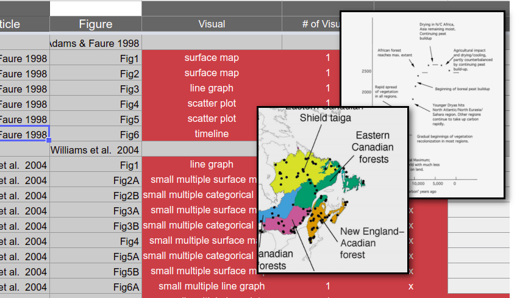

# PaleoVisualization

<!-- badges: start -->

[]

<!-- badges: end -->

A broad survey of visualization techniques in the geoscientific literature, based on publications that cite Neotoma.

## Contributors

Please note that this project is released with a [Contributor Code of Conduct](CODE_OF_CONDUCT.md).  By participating in this project you agree to abide by its terms.

## Data and Vignette

This repository is intended to act as a data resource for work by [Ross Thorn](https://rossthorn.github.io/) as part of the [NSF Geosciences Funded](https://www.nsf.gov/awardsearch/showAward?AWD_ID=1550855&HistoricalAwards=false) [FlyOver Country project](http://flyovercountry.io).

The role of this repository is two-fold:

1.  It provides the testing interface to move hand-coded data from their original Google Sheets format into a machine-readable format that can be distributed through this GitHub repository.

This content is contained within the Rmd file [generate_data.Rmd](), or as rendered as [generate_data.html](http://htmlpreview.github.io/?https://github.com/NeotomaDB/PaleoVisualization/blob/master/generate_data.html).  As indicated, this work is under development.

2.  To provide vignettes of the data that show several interesting and informative methods for displaying the data, that underly the strengths and weaknesses of this dataset, to provide some guidance to users who wish to reuse this data.